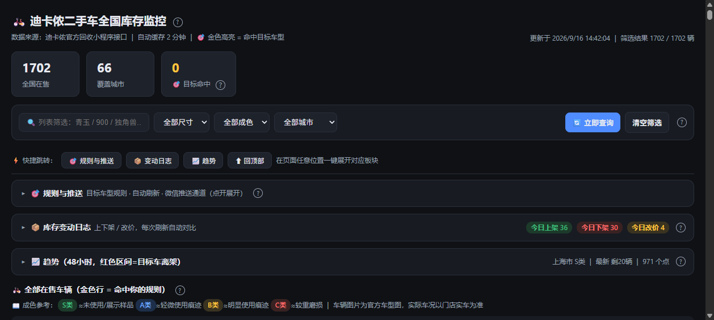

# 🚲 迪卡侬官方二手车全国捡漏监控

> 监控迪卡侬官方回收平台（buyback.decathlon.com.cn）全国 66 城的在售二手自行车/童车，关键词+价格规则命中后 **30 秒内推送微信**，自带本地网页看板。
>
> *Decathlon official buyback (second-hand) nationwide monitor with a local web dashboard and WeChat push alerts.*



## ✨ 功能

- **全国 66 城并发扫描**：10 线程并发 + 自动翻页，单轮 1700~2200 辆在售车
- **规则命中警报**：关键词（且关系）+ 价格区间 + 城市 三要素规则，命中即金色高亮 + 推送
- **服务端推送**：守护线程每 30 秒巡检，关掉浏览器照样推；Server酱 / PushPlus / 阿里云短信 / 腾讯云短信 多通道广播，失败通道自动补发
- **库存变动追踪**：上架🟢 / 下架🔴 / 改价💲 自动 diff；防抖去除跨城/短时间抖动的假事件
- **目标车生命周期**：被抢/改价/重新上架单独告警，多城市同款独立跟踪（`城市|sku` 复合键）
- **网页看板**：统计卡 / 多维筛选 / 分页大表 / 命中横幅 / 实拍图画廊 / 官方车况报告 / 48 小时价格趋势图 / 快捷跳转导航
- **图片代理**：服务端 Pillow 缩放 + 磁盘缓存，列表小图秒开，灯箱看大图不卡
- **规则变更即重扫**：改完规则立刻用当前数据重跑匹配，把「改规则前就已命中但从未推过」的存量车补推出来（不会漏掉已在架的车）；匹配同步完成、推送走后台线程，点保存不卡顿
- **接口健康检查**：官方一旦改字段名（如价格字段失效），车还在架但规则永不命中 —— 这类「静默停摆」会被检测到并推送告警，看板顶部同步显示红色提示
- **`output/` 自动清理**：每天自动清理一次 —— 巡检日报留 7 天、日汇总留 30 天、SQLite 真空回收空间，长期挂机磁盘不涨
- **只读模式**：`readonly.flag` / `DT_READONLY=1` 开关 —— 只展示快照不访问官方接口
- **看门狗自愈**：Windows 计划任务每 5 分钟探活拉起（Mac/Linux 见下文 launchd / systemd 方案）

## 📦 安装

```bash
git clone https://github.com/<YOU>/decathlon-buyback-monitor.git
cd decathlon-buyback-monitor
pip install -r requirements.txt
```

要求：Python 3.10+（图片代理需要 Pillow）。

## 🚀 快速开始

1. **配置接口**（默认可用）：`config.json` 已内置官方公开接口参数，可参考 `config.example.json` 按自己抓包结果调整城市/坐标
2. **配置推送**：`cp push_config.example.json push_config.json`，填入你的 Server酱 SendKey（[sct.ftqq.com](https://sct.ftqq.com) 免费申请）等
3. **配置目标规则**：`cp targets.example.json targets.json`，改自己的关键词和预算
4. **启动看板**：

```bash
python webapp.py
# 浏览器打开 http://localhost:8787
```

5. **（可选）看门狗自愈**：Windows 任务计划程序创建任务，每 5 分钟运行 `watchdog.bat`；服务挂掉自动拉起，`readonly.flag` 存在时以只读模式启动

## 🍎🐧 macOS / Linux 部署

代码本身是纯 Python 标准库 + Pillow，**跨平台可直接跑**；只有「看门狗自愈」这一层是平台相关的（`watchdog.bat` / `start_*.bat` 仅 Windows）。Mac/Linux 用下面的方式替代。

### 1. 安装与启动

```bash
python3 -m venv .venv
source .venv/bin/activate
pip install -r requirements.txt      # Pillow 用于图片代理（服务端缩放，浏览器只看小图）

cp push_config.example.json push_config.json
cp targets.example.json targets.json

python3 webapp.py                    # 打开 http://localhost:8787
```

> 端口被占用时查：`lsof -i :8787`（macOS/Linux）或 `ss -ltnp | grep 8787`（Linux）。**务必保证只有一个实例**，多实例会重复扫描、重复写变动日志。

### 2. 常驻 + 崩溃自愈

**macOS（launchd，推荐）** — 存为 `~/Library/LaunchAgents/com.decathlon.monitor.plist`，路径改成你自己的：

```xml
<?xml version="1.0" encoding="UTF-8"?>
<!DOCTYPE plist PUBLIC "-//Apple//DTD PLIST 1.0//EN" "http://www.apple.com/DTDs/PropertyList-1.0.dtd">
<plist version="1.0"><dict>
  <key>Label</key><string>com.decathlon.monitor</string>
  <key>ProgramArguments</key>
  <array>
    <string>/absolute/path/to/.venv/bin/python</string>
    <string>/absolute/path/to/webapp.py</string>
  </array>
  <key>WorkingDirectory</key><string>/absolute/path/to/project</string>
  <key>RunAtLoad</key><true/>          <!-- 登录即启动 -->
  <key>KeepAlive</key><true/>          <!-- 挂了自动拉起 -->
  <key>StandardOutPath</key><string>/tmp/decathlon-monitor.log</string>
  <key>StandardErrorPath</key><string>/tmp/decathlon-monitor.err</string>
</dict></plist>
```

```bash
launchctl load  ~/Library/LaunchAgents/com.decathlon.monitor.plist   # 启用
launchctl unload ~/Library/LaunchAgents/com.decathlon.monitor.plist  # 停用
```

**Linux（systemd 用户级，推荐）** — 存为 `~/.config/systemd/user/decathlon-monitor.service`：

```ini
[Unit]
Description=Decathlon buyback monitor
After=network.target

[Service]
Type=simple
WorkingDirectory=/absolute/path/to/project
ExecStart=/absolute/path/to/.venv/bin/python webapp.py
Restart=always
RestartSec=10

[Install]
WantedBy=default.target
```

```bash
systemctl --user enable --now decathlon-monitor   # 开机自启 + 立即启动
systemctl --user status decathlon-monitor
loginctl enable-linger $USER    # 服务器/无桌面场景，保证注销后仍在跑
```

**兜底方案（cron，任意 Unix）** — 每 5 分钟探活，`flock` 防止重复启动：

```bash
*/5 * * * * flock -n /tmp/dtm.lock -c 'curl -sf http://127.0.0.1:8787/api/query >/dev/null || (cd /absolute/path/to/project && exec /absolute/path/to/.venv/bin/python webapp.py >> webapp.log 2>&1)'
```

### 3. 平台差异对照

| 项目 | Windows | macOS / Linux |
|---|---|---|
| 启动命令 | `python webapp.py` | `python3 webapp.py` |
| 看门狗 | 计划任务 + `watchdog.bat` | launchd `KeepAlive` / systemd `Restart=always` / cron + flock |
| 只读模式 | `readonly.flag` 文件（watchdog 读取） | `DT_READONLY=1 python3 webapp.py`（环境变量直接生效） |
| 日志 | `webapp.log` | launchd/systemd 指定路径，或 shell 重定向 |
| 端口排查 | `netstat -ano \| findstr 8787` | `lsof -i :8787` |

## 🖐️ 接口怎么来的

官方回收小程序的接口无需登录凭证，公开可调。想自己重新抓包（换城市/品类参数）看 [docs/抓包教程.md](docs/抓包教程.md) 和 [零基础手把手版](docs/抓包教程-手把手版.md)（使用 Reqable，全程点鼠标）。

## 📁 目录结构

```
├── webapp.py             # 网页看板 + 服务端守护推送（核心，单文件）
├── decathlon_monitor.py  # 命令行扫描器（config.json 驱动）
├── wechat_push.py        # 多通道推送（Server酱/PushPlus/阿里云短信/腾讯云短信）
├── tracker.py            # 库存变动 diff + 防抖（城市|sku 复合键）
├── rules.py              # 目标规则匹配
├── history.py            # 价格/库存历史（SQLite，趋势图数据源）
├── daily_report.py       # 每日日报生成+推送
├── avatar.py             # 实拍图/官方车况详情（免凭证双接口）
├── build_cities.py       # 城市门店坐标表构建
├── cleanup.py            # output/ 自动清理（日报/SQLite 真空/日志截断，每天一次）
├── cities.json           # 全国城市/门店坐标
├── watchdog.bat          # 看门狗（Windows 计划任务用，支持只读模式开关）
├── py_test.py            # Python 回归测试（29 断言）
├── sim_pg.js / js_test.js / js_check.js  # 前端模拟/检查
└── docs/                 # 抓包教程
```

## 🧪 测试

```bash
python py_test.py      # tracker/rules/生命周期/规则重扫/清理 29 断言
python cleanup.py --dry  # 先看会删什么（不真删）
node js_test.js        # 前端逻辑测试（需服务运行）
```

## ⚠️ 免责声明

- 本项目仅供个人学习与研究，请勿用于任何商业用途
- 数据来自迪卡侬官方回收平台公开接口，版权归迪卡侬所有；请控制扫描频率，尊重平台服务
- "迪卡侬 / Decathlon" 商标归其权利人所有，本项目与其无任何关联
- 请合理设置扫描间隔（内置了 25 秒强刷节流与 2 分钟数据缓存），勿对官方接口造成压力

## 📄 License

[MIT](LICENSE)
